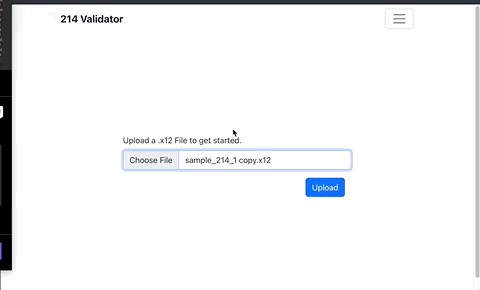

# Validator44214

### STACK
  - MERN 
  - Redux Toolkit

### Link
- https://validator44214.onrender.com/

### Usage
App allows for .x12 uploads to the server which will call and EDI translation service based on the EDI Fabric Model and API Service. The Read page will display the values of the 214 x12 document. If there are any x12 structure errors, the errors will display and will not let validate the contents of the file. The Validate page will validate the contents of the file based EDI Fabric Open API model created.

